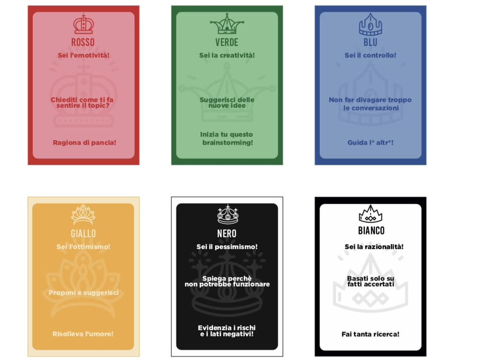
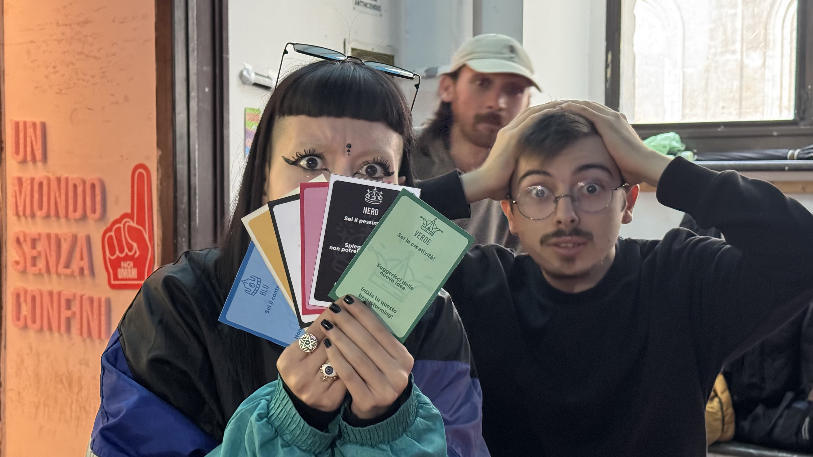

---
date:
  created: 2025-01-30

---
# Il metodo delle 6 corone
Peppe ci ha suggerito di utilizzare, per non divagare nelle nostre discussioni, il metodo dei sei cappelli, da noi ribattezzato **metodo delle sei corone!**
Ognuno di noi pesca una carta, che corrisponde ad uno stato d'animo: la persona che ha pescato la carta dovrà trattare la tematica proposta seguendo l'ottica dettata dalla carta che gli è capitata.

