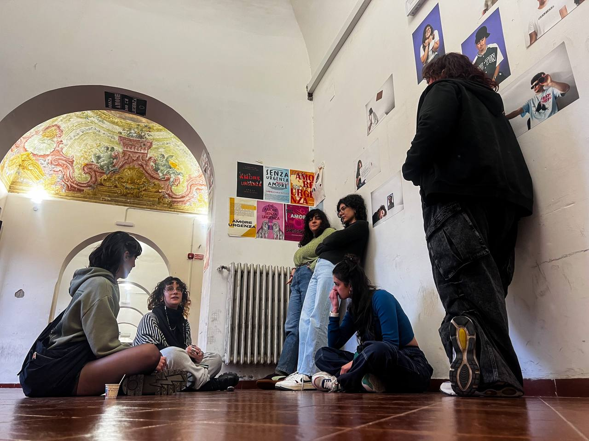

---
date:
  created: 2025-01-23

---
# ManifestA!
Aspirando ad essere mutevoli, anche il nome del gruppo cambia, diventando **ManifestA!**
Questa scelta è stata dettata da due motivi principali. 
 
**1.** Il gioco al **femminile**: il gruppo è composto da sole donne, non per volontà nostra, ma abbiamo notato che questa caratteristica dissuade i ragazzi del laboratorio dal prendere parte alla discussione. (*N.B. i gruppi di sole donne intimoriscono gli uomini, soprattutto se sono donne femministe!*)
 
**2.** "Manifesta" come **verbo** all'imperativo, come azione attiva da compiere per cambiare le cose.

