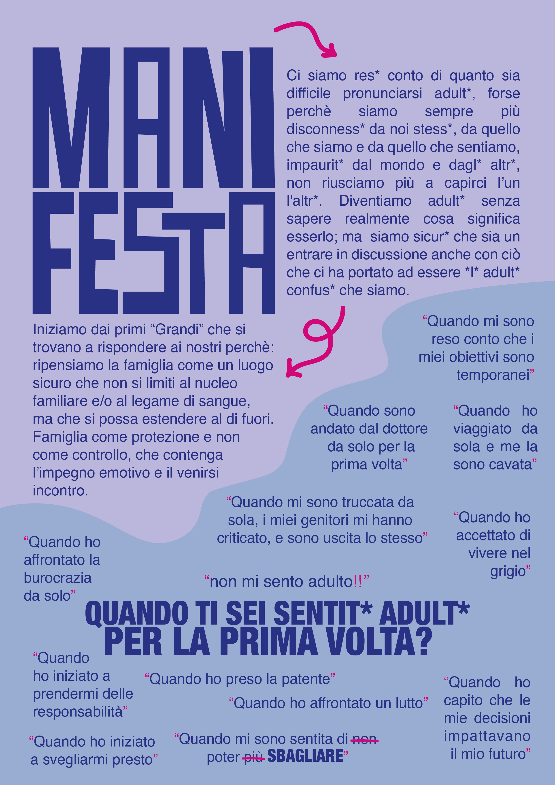

---
date:
  created: 2025-01-24
readtime: 1
---
# Essere Adulti
Il tema di oggi è essere adulti, e abbiamo fatto una domanda al laboratorio:
*Quando ti sei sentito adulto per la prma volta?*

Il laboratorio ha dato tantissime risposte diverse, ma la costante era una: il caricarsi di **responsabilità**. Diventiamo adulti senza sapere realmente cosa significa esserlo, ma sembra quasi che si diventa adulti quando non puoi più sbagliare.
Dovremmo capire che non è così.

*"Crescere significa stringere a noi il bambino che ci portiamo dentro e vivere una vita da adulti."* (Che significa diventare adulti?, Banana Yoshimoto)

{width="500px" height="100px" style="display: block; margin: 0 auto;"}
{width="500px" height="100px" style="display: block; margin: 0 auto;"}