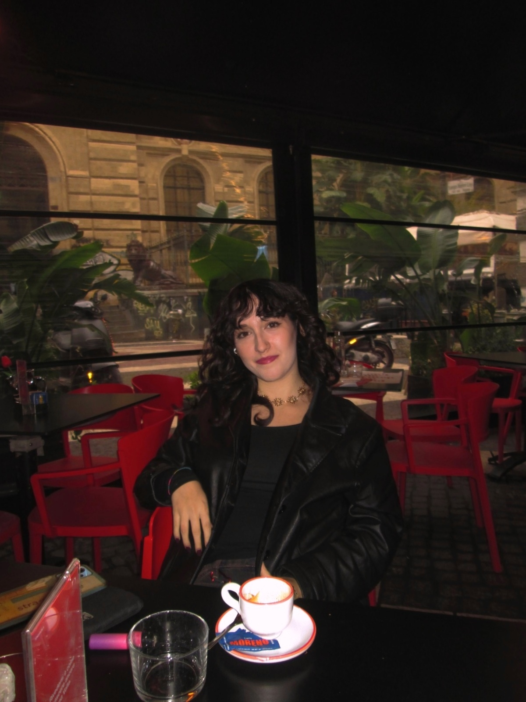

Mi chiamo <strong>Giulia Genovese</strong> e sono nata a Napoli nel dicembre del 2004. L’arte è sempre stata parte della mia vita, da piccola osservavo mio padre realizzare le locandine per i suoi locali: è stato il mio primo incontro con Photoshop.

Da ragazzina ho cominciato a sperimentare, realizzando grafiche e video, e durante le superiori mi occupavo delle copertine del giornalino del mio liceo, dove, nel 2023, ho conseguito la maturità classica. 

Attualmente frequento il secondo anno del corso di Nuove Tecnologie dell’Arte presso l’Accademia di Belle Arti di Napoli, dove la mia ricerca artistica si sta sviluppando sempre più verso l’intermedialità, esplorando l'integrazione di diverse tecniche per creare opere d’arte.

Oltre all'arte, coltivo diverse altre passioni: amo studiare, specialmente per perfezionare il mio inglese, leggere, e mi interessano il cinema e la moda. Nella vita, come nell’arte, ho un approccio massimalista

 
<!DOCTYPE html> 
<html>
<head>
 
</head> 
<body>

<h1 class="animated-text"><strong>Questa sono io<strong></h1> 
<h1 class="slide-in-text">Yeah</h1>

</body> 
</html>

